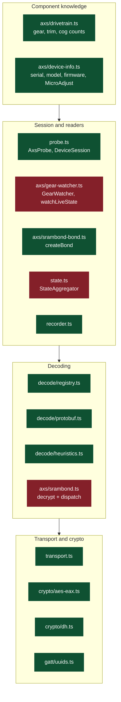
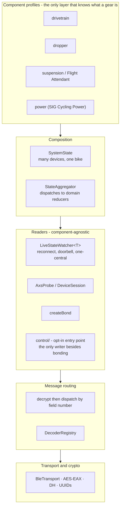

# Architecture: current state and target

`GearWatcher` is the most visible export in this library, and the name says
"derailleur". AXS is not a derailleur platform — it is one radio protocol shared
by derailleurs, dropper posts, power meters and suspension. This document asks
how much of the codebase actually assumes a derailleur, and marks where it
should end up before that assumption becomes load-bearing.

> Code in the *target* sections is a proposal. It describes APIs that do not
> exist yet, and is deliberately excluded from the documentation type-check that
> covers `README.md` and the package READMEs.

---

## The rule

One rule decides everything below:

> **Component knowledge lives at the edge. Nothing beneath it knows what a gear
> is.**

A layer that knows about gears cannot be reused for a dropper post. A layer that
knows only about bytes, connections and messages can. The good news from the
audit is that this rule already holds for most of the stack — the violations are
concentrated, few, and fixable while the package is still at 0.1.

---

## Current state



Green is component-neutral today. Red is where the derailleur leaked in.

### What is already neutral

| Module | Why it holds up |
|---|---|
| `transport.ts` | Plain GATT. No AXS knowledge whatsoever. |
| `frame.ts` | A frame is bytes plus provenance. The capture-first rule is what makes every later addition cheap. |
| `probe.ts` | Enumerates whatever the device exposes; polls by UUID filter. Never mentions gear. |
| `decode/registry.ts` | `Decoder` is a pure `frame → DecodedResult \| null` with an open `fields: Record<string, unknown>`. Already the right extension point. |
| `crypto/` | AES-EAX and finite-field DH. Protocol-agnostic. |
| `gatt/uuids.ts` | A UUID knowledge base. Purely additive. |
| `identify.ts` | `AxsDeviceKind` already carries `dropper-post`, `power-meter`, `suspension`, `tire-pressure`. |
| `device-info.ts` | `AXS_MODELS` already maps 1018 Reverb, 1038/1039 Flight Attendant, 7/1052 Quarq. |
| `recorder.ts` | Serialises frames. Indifferent to their meaning. |

`axs/drivetrain.ts` is also fine, and is worth calling out as the model to copy:
it is component knowledge that stays *inside* a component module and exposes a
plain decode function over plaintext bytes.

So the pipeline is not the problem. Three specific things are.

---

## Finding 1 — the state model is a closed, flat record

`AxsDeviceState` in [state.ts](packages/axs-core/src/state.ts) gives gear
top-level status alongside identity:

```ts
gearRear: ValueSource<number> | null;
gearFront: ValueSource<number> | null;
totalRear: ValueSource<number> | null;
totalFront: ValueSource<number> | null;
shiftCount: number;
```

This is the deepest bias in the codebase, and the most expensive one to leave.
A Reverb post has no rear gear, but under this type it *has the field*,
permanently null. Add dropper position, power, cadence, Flight Attendant mode
and bias, and the record becomes a union of every component that exists, mostly
null for any given device — a type that lies about the thing it describes.

`StateAggregator.ingest` has the matching problem: it hardcodes the field names
it folds, and carries drivetrain semantics directly, including the shift-count
arithmetic and the 256-wrap of the plaintext counter. Adding a component means
editing the aggregator, which is exactly the coupling the decoder registry was
designed to avoid.

Consumers inherit it. The CLI prints `state.gearRear` / `state.totalRear`
directly; the demo dashboard reads `state.shiftCount`.

## Finding 2 — the watcher is 90% generic and 10% drivetrain

[gear-watcher.ts](packages/axs-core/src/axs/gear-watcher.ts) is the most
valuable file in the package, because it encodes what the hardware actually
does: components serve one central at a time, they drop idle links within
10–100 seconds, `d905000b` notifies a content-free `0xff` doorbell so state only
arrives on a *read*, and a slow read must not queue behind itself.

None of that is about gears. All of it applies unchanged to a dropper post or a
Flight Attendant fork.

Only two things in the whole file are drivetrain-specific:

- `LIVE_STATE_CHARACTERISTIC` is hardcoded,
- `decodeSrambondState` is hardcoded, so the reading is always a
  `DrivetrainStatus`.

The bias here is the type signature and the name, not the machinery. That is a
good position to be in — but the machinery is exactly what must not be
copy-pasted per component, because it was learned on hardware and will be
re-learned wrongly.

## Finding 3 — the encrypted channel is a multiplexed pipe with a hardcoded router

`createSrambondDecoder` in [srambond.ts](packages/axs-core/src/axs/srambond.ts)
decrypts (generic), then tries `drivetrain_status` (fields 20–22), then
`drivetrain_config` (23–25), then falls back to hex.

The important protocol fact is buried in that if-chain: **one encrypted
characteristic carries several different messages, told apart by protobuf field
number.** That is a real concept the architecture should name. A dropper post
message is another entry in a routing table, not another branch in a function
that also owns the crypto.

The unmapped fallback that emits `decryptedHex` should stay exactly as it is —
during reverse engineering it is the most useful output in the library.

## Finding 4 — everything is single-device, and Flight Attendant is not

This one has nothing to do with naming. `AxsProbe.probe(deviceId)` yields one
`DeviceSession`; `StateAggregator` is constructed per device; the demo tracks
one connection.

Flight Attendant is a *system*: a fork and a rear shock, reacting to pedalling
input from a power meter and to the drivetrain. Reading it means holding several
peripherals at once and folding them into one bike-level state. The "one central
at a time" limit is per peripheral, so concurrent connections to *different*
components should be possible — but the practical ceiling on a phone (typically
around seven GATT links, fewer in practice) has not been tested here and should
be measured before the design leans on it.

Nothing in the current model forbids multi-device. There is simply no layer that
expresses it, and gear-only work would never have surfaced the gap.

### Secondary, cheap to fix

- The CI entry-point smoke test asserts `GearWatcher` is a function. The canary
  for "does the package load" should not be a drivetrain name — `AxsProbe` is
  the neutral choice.
- `simulatedDerailleur` is the only simulated device. Given that the entire
  hardware-free test story rests on the simulator, each new family needs one;
  `FakeDeviceSpec` is already generic enough to take them.
- `apps/cli` has a `gear` command and the demo has `LiveGear`. App-level naming
  is fine and should stay concrete.

---

## The decision that is not about modularity: writes

"Gear micro adjustment" is not a decoding problem. Micro-adjust is currently
*read* from `d905000a`; adjusting it means **writing to a derailleur bolted to a
bicycle**. Dropper actuation and Flight Attendant mode changes are the same
category.

The library currently holds a hard invariant, and a test enforces it —
`probe.test.ts:141`, *"never writes to any characteristic during a probe"*.
`createBond` is the only writer, and it writes only to the SRAMBond service.
That invariant is why this tool is safe to point at your own bike; the Nordic
buttonless DFU control point sits in the same GATT tree and reboots the
component into its bootloader.

Adding control must not weaken it. The target keeps the guarantee enforceable by
the module graph rather than by discipline:

- all writing operations live in a `control/` module, reachable only through a
  separate entry point (`@gaborwnuk/axs-core/control`), so a consumer who never
  imports it *cannot* write;
- every operation is named and understood — no generic `write(uuid, bytes)`
  escape hatch;
- a guard rejects the DFU control point explicitly;
- `AxsProbe` never reaches into it, and the existing regression test stands.

Worth stating plainly: the micro-adjust write protocol has not been reverse
engineered, and unlike reading, a wrong guess here moves a motor.

---

## Target architecture



### Move A — open the state model

Keep flat what is genuinely universal; namespace what is not.

```ts
interface AxsDeviceState {
  // Every AXS component has these.
  deviceId: string;
  deviceName: string | null;
  serialNumber: ValueSource<string> | null;
  firmwareRevision: ValueSource<string> | null;
  batteryPercent: ValueSource<number> | null;
  // …identity and battery as today

  /** Component-specific state, present only for domains this device reports. */
  domains: {
    drivetrain?: DrivetrainDomain; // gearRear, gearFront, totals, shiftCount
    dropper?: DropperDomain;
    suspension?: SuspensionDomain;
    power?: PowerDomain;
  };
}
```

`StateAggregator` stops knowing field names and becomes a dispatcher over
**domain reducers**, each declaring which decoded fields it consumes:

```ts
interface DomainReducer<S> {
  domain: string;
  /** Decoded field names this reducer reacts to. */
  consumes: readonly string[];
  reduce(state: S | undefined, fields: Record<string, unknown>, meta: Provenance): S | undefined;
}
```

The shift-count arithmetic and the `shift` event move into the drivetrain
reducer, where they belong. Confidence-based overwriting and provenance stay in
the aggregator, because those are universal.

Prefer the namespaced object over a fully generic `Map<string, unknown>`: it
keeps type safety, and it makes *"which domains does this device report"* a
first-class question, which is precisely what a UI needs in order to render a
dropper post without a gear widget.

**This is breaking.** At 0.1.0 that costs almost nothing; after 1.0 it costs a
major version and every consumer's time. Deprecated `gearRear` accessors can
bridge one release.

### Move B — generalise the watcher, keep the ergonomic wrapper

```ts
interface LiveStateWatcherOptions<T> {
  deviceKey: Uint8Array;
  /** Defaults to d905000b. */
  characteristic?: string;
  /** What the decrypted plaintext means for this component. */
  decode: (plaintext: Uint8Array) => T;
  pollIntervalMs?: number;
  reconnectPolicy?: Partial<ReconnectPolicy>;
}

class LiveStateWatcher<T> { /* connect, poll, decrypt, reconnect */ }
```

`GearWatcher` survives as a thin wrapper — `LiveStateWatcher<DrivetrainStatus>`
plus the `gear` change event and `currentGear`. It is the published API and a
genuinely good default; it just stops being the only way in. `watchLiveState`
gains a `decode` option with the drivetrain decoder as its default, so existing
calls keep working.

The payoff: the doorbell semantics, the backoff, the one-central rule and the
in-flight guard are written once and inherited by every component family.

### Move C — a message profile registry

```ts
interface MessageProfile<T> {
  name: string;                     // "drivetrain_status"
  /** Field numbers that identify this message in the shared channel. */
  fieldNumbers: readonly number[];  // 20, 21, 22
  decode(plaintext: Uint8Array): T | null;
  toFields(value: T): Record<string, unknown>;
}

createSrambondDecoder(key, profiles = AXS_MESSAGE_PROFILES);
```

Adding dropper support becomes one profile registration. The crypto layer never
changes again, and `decryptLiveStateFrame` stays the single seam between "peel
off AES-EAX" and "interpret the plaintext" — a split the code already has and
should keep.

### Move D — profiles keyed to the component, selected automatically

Today `identifyDevice` yields a kind from the advertisement and
`axsModelKind(modelId)` yields one from `d905fe56`, but nothing connects a kind
to the decoders and domains it needs.

```ts
interface ComponentProfile {
  kind: AxsDeviceKind;
  models?: readonly number[];     // fe56 identifiers this covers
  decoders: readonly Decoder[];   // extra decoders to register
  domains: readonly DomainReducer<unknown>[];
  liveState?: { characteristic: string; decode(plaintext: Uint8Array): unknown };
}
```

`AxsProbe` already reads `fe56` during its identity pass, so it can select the
profile itself. That is the mechanism that delivers "connect to any AXS
component and get the right values" without the caller knowing in advance what
they connected to — and it is what turns this from a derailleur tool into an AXS
tool.

### Move E — the control boundary

As set out above: a separate `control/` module behind its own entry point, named
operations only, DFU guarded, probe untouched, regression test intact. Decide
this *before* the first write lands, not during it.

### Move F — a simulator per family

`simulatedDerailleur()` gains siblings: `simulatedDropperPost()`,
`simulatedPowerMeter()` (standard Cycling Power Service, no key at all),
`simulatedFlightAttendant()`. The convention to establish is that **a new
component family arrives with a hardware-free test**, the same way the
derailleur did.

### Move G — a bike-level aggregate

A `SystemState` above `StateAggregator`, holding several devices and answering
bike-level questions. Needed for Flight Attendant; also the natural home for
cross-component correlation, such as pairing a shift event against a power
sample.

---

## Does the target hold up?

Checked against the four components named as future work:

| Component | Data path | Key? | New code under the target |
|---|---|---|---|
| **Quarq power meter** | Standard SIG Cycling Power Service (`0x1818`) — almost certainly *not* SRAMBond | No | One decoder, one domain reducer. No crypto, no profile registration in the encrypted channel. |
| **Dropper post** (Reverb AXS, model 1018) | SRAMBond live state, new message | Yes | One message profile, one domain reducer, one simulator. |
| **Flight Attendant** (fork 1038, shock 1039) | SRAMBond live state, plus system-level mode and bias | Yes | As dropper, ×2 — plus Move G, the multi-device aggregate. |
| **Gear micro-adjust** | Write path, protocol not yet reverse engineered | Yes | Move E. Not a modularity question at all. |

The power meter row is the useful stress test, because it breaks an assumption
the current design quietly makes: that component data arrives through the
SRAMBond live-state channel. It does not. Power almost certainly arrives through
a SIG-standard service with no key involved. The open state model (Move A) and
the keyless decoder registry both survive that; a closed record with
`gearRear` on it would not have.

---

## Sequencing

Ordered by how much the cost grows if deferred.

1. **Open the state model (Move A).** Breaking. Cheap now at 0.1.0, expensive
   after 1.0. Do this first.
2. **Generalise the watcher (Move B).** Non-breaking. Do it before a second
   component tempts anyone to copy the file.
3. **Message profile registry (Move C).** Non-breaking, additive.
4. **Component profile registry (Move D).** Non-breaking, new surface.
5. **Control boundary (Move E).** A decision, not code. Needs to exist before
   the first write is written, not during.
6. **Simulators and the bike-level aggregate (Moves F, G).** Land alongside the
   first component that needs them.

Nothing here requires hardware to start. Moves A through D are refactors of code
that is already tested against captured frames, so the existing suite is the
safety net.
