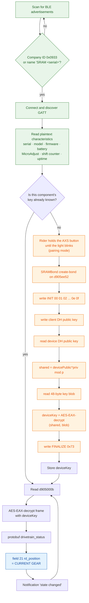
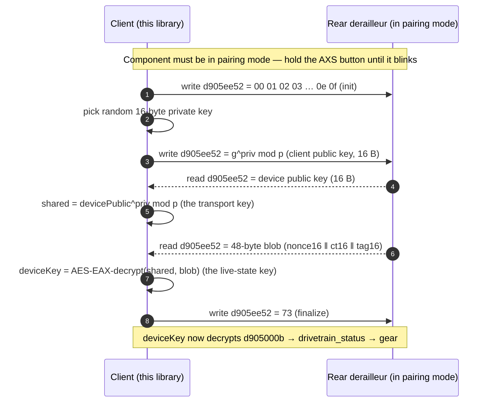

# SRAM AXS over Bluetooth Low Energy — Protocol Notes

A complete, working description of how a SRAM AXS drivetrain presents itself over
Bluetooth Low Energy: how it is identified, what reads in the clear, how the live
state (including current gear) is protected, and the full pairing handshake — the
exact reads and writes — that lets a client read gear with no cloud and no
account.

Everything here is reproduced byte-for-byte by the code in this repo
(`@axs/core`) and was verified against real hardware under controlled conditions,
including a run with the device offline (airplane mode) and all local state
wiped, to prove no part of it depends on SRAM's servers.

**Scope: the AXS platform, not one derailleur.** SRAM AXS is a single wireless
platform — the same BLE stack, the same SRAMBond pairing, the same
protobuf-encoded messages — shared across rear and front derailleurs, drop-bar
shifters and AXS Controllers, the Reverb AXS seatpost, Flight Attendant fork and
shock, TyreWiz tyre-pressure sensors, Quarq power meters and Eagle Powertrain
e-bike systems. Nothing in this document or the library is specific to one
product: identification, pairing and decoding are written against the platform.

What differs between components is *which* messages they serve. A seatpost has no
`drivetrain_status`; a derailleur has no tyre pressure. The transport and the
crypto are the same everywhere.

**Verified on:** SRAM GX Eagle Transmission **`RD-GX-E-B1`** (T-Type, UDH
direct-mount, serial `1503603158`, firmware `2.55.6`) and an **AXS Controller**
on the same bike — the only AXS components the author owns. Everything described
here is confirmed on that hardware; the platform-level behaviour is expected to
hold across the range, and support for other components will be confirmed as
they become available.

---

## At a glance

The whole path from a cold radio to a live gear number. Everything on the left is
open; the gear itself sits behind one physically-gated pairing step.



---

## 1. Three radios, one reachable from a phone

An AXS rear derailleur is a three-radio device — SRAM says so in its own FCC
filing for the AXS MTB rear derailleur (FCC ID `C9O-RDMB2`): a *"Rear Derailleur
with BLE, AIREA and ANT+ Radios."*

| Radio | Between | Role | Reachable from a phone? |
|---|---|---|---|
| **AIREA** | shifter ⇄ derailleur | The actual shifting link | No — proprietary, not exposed to third parties |
| **ANT+** | derailleur → world | One-way telemetry broadcast (gear, battery, shift counts) | No — phones no longer carry ANT+ radios |
| **BLE** | derailleur ⇄ app | Configuration, diagnostics, live state, firmware | Yes |

Two facts fall straight out of this and drive everything:

- **Shifting is not on BLE.** The command that moves the derailleur travels over
  the dedicated AIREA link. The BLE interface is a *state and configuration*
  interface, never a drivetrain *control* interface. This is central to the
  security assessment in §9.
- **ANT+ is not a usable target.** It broadcasts some telemetry in the clear (it
  is how bike computers show your gear), but current phones — iOS entirely, and
  now essentially all Android hardware — have dropped the ANT+ radio, and it
  carries only a fraction of what the component exposes. **BLE is the only
  surface this project pursues**, and everything below concerns it.

---

## 2. The Bluetooth interface

### 2.1 Identifying a component

- Advertises under Bluetooth SIG company identifier **`0x0933`** (SRAM).
- Advertised local name is **`SRAM <serial>`** — e.g. `SRAM 1503603158` — the
  same serial exposed inside the GATT tree.

### 2.2 Service layout

Standard SIG services plus a larger set of vendor-defined ones. Observed vendor
UUID families:

```
d905XXXX-90aa-4c7c-b036-1e01fb8eb7ee     primary SRAM service family
adee000X-772[67]-453c-a069-007ea97a0add  a second vendor family
0xFE51                                    a 16-bit SIG member service
```

All SRAM vendor UUIDs are the 16-bit value `XXXX` expanded into the fixed base
`d905XXXX-90aa-4c7c-b036-1e01fb8eb7ee`, so the tables below name only the short
form. The complete map of what is known on an `RD-GX-E-B1`:

| UUID | Contents | Access | Encrypted? |
|---|---|---|---|
| `0x2A19` | Battery level, 0–100 % (standard SIG) | read, notify | no |
| `d905fe54` | Device serial, little-endian `uint32` | read | no |
| `d905fe56` | Model / product ID, little-endian `uint16` | read | no |
| `d905fe58` | Device record: firmware triplet + ASCII git build id | read | no |
| `d905fff2` | Identity, protobuf (field 25 → nested field 22 = serial) | read | no |
| `d905000a` | MicroAdjust: protobuf fields 23/24/25 = min/current/max | read | no |
| `d9050003` | **Usage record**, 54 bytes: shift counter, uptime | read, notify | no |
| **`d905000b`** | **Live state: `drivetrain_status` → current gear** | read, notify | **yes** |
| `d9050025` | `drivetrain_config`: cassette gear counts | read | yes |
| `d9050054` | Further live state (announces changes) | read, notify | yes |
| `d905ee51` / `d905ee52` / `d905ee53` | **SRAMBond v1**: service, bond/data, token | read, write, notify | handshake |
| `d905ee58` / `ee59` / `ee5a` / `ee5b` | SRAMBond v2: service, challenge, KEX, create-bond | read, write, notify | handshake |
| `d90500f1`–`f9`, `d9050024`, `d9050028/29` | Additional encrypted state, not yet mapped | read | yes |
| `0xFE59` | Nordic Secure DFU — **never write here** | — | — |

Two practical notes:

- **No standard Device Information Service (`0x180A`).** Serial, model and
  firmware live in vendor characteristics, not the usual place.
- The component **sleeps aggressively and drops an idle connection within
  ~10–100 s.** Wake it (AXS button, or bounce the bike) and expect to reconnect.
  "Present but silent" is normal; a long-running reader needs auto-reconnect.

### 2.3 Payloads are protocol-buffer encoded

Several vendor characteristics carry Protocol Buffers — a compact tag/field
encoding. This is the key structural fact about the interface: it turns opaque
blobs into walkable trees of numbered fields. The library ships a schema-less
protobuf reader that reconstructs field trees from raw bytes.

---

## 3. What reads cleanly, with no session

Readable directly, no pairing, every value cross-checked against the app.

| Value | Characteristic | Encoding | Verified against |
|---|---|---|---|
| **Serial** | `d905fe54` | little-endian u32 → `1503603158` | App "Serial", advertised name, a protobuf copy in `d905fff2` |
| **Model / product ID** | `d905fe56` | little-endian u16 → `1075` | App "Model: RD-GX-E-B1" |
| **Firmware + build ID** | `d905fe58` | version triplet at offset 5, **patch-first** (`06 37 02` → `2.55.6`); ASCII git build id at the tail (`g313caa0ed6.dir`) | App "Firmware Version: 2.55.6" |
| **MicroAdjust** | `d905000a` | protobuf: min / current / max → `1 / 12 / 23` | App MicroAdjust screen |
| **Battery %** | `0x2A19` | standard SIG Battery Service | App battery indicator |

Two more surface from the one plaintext characteristic that *changes* in use,
`d9050003` (a ~54-byte live record): a **cumulative shift counter** at offset 50
(verified twice — exactly **+22** across a full 1→12→1 sweep) and a **16-bit
uptime** at offsets 46–47. These decoders, derived on the derailleur, then read a
previously-unseen AXS Controller correctly on first contact — evidence they are
general, not overfitted.

---

## 4. Where gear lives

### 4.1 Gear is on BLE, in the encrypted live-state channel

The app shows current gear live over BLE. It is **not** in any plaintext
characteristic (four full 1→12→1 sweeps polling every readable characteristic
found no plaintext gear ordinal). It travels **encrypted on characteristic
`d905000b`** as the `drivetrain_status` protobuf:

| Field # | Name | Meaning |
|---|---|---|
| 20 | `fd_position` | front derailleur position (absent on a 1x transmission) |
| **21** | **`rd_position`** | **rear derailleur position — the current gear (1…12)** |
| 22 | `rd_trim` | trim offset |

The companion `drivetrain_config` gives the gear counts (`rd_num_gears = 12`), so
`rd_position` renders as "7 of 12".

Decoding it needs the component's per-device key (§5–§6). Once you hold that key,
**a plain GATT read of `d905000b` decrypts directly — no session state required**
(the frame is self-contained: it carries its own nonce and tag).

### 4.2 Why the derailleur, not the handlebar pod

The derailleur is the **AXS primary / bridge**: it holds and reports live
drivetrain state and relays battery for the paired components. Only a device with
a rechargeable AXS battery can be the primary; the pod runs a coin cell and is
not. Tested directly, the AXS Controller pod exposes one service, five
characteristics, none notifiable, and not one byte changed across 121 reads while
its buttons were pressed. Its presses leave over AIREA, not BLE. The derailleur
is the gear source.

### 4.3 Caveat: the plaintext field that looks like gear but is not

`d9050003` offset 14 moves when you shift, and is the obvious false lead. It is
not gear: across a park-and-hold calibration it is non-monotonic (it peaks
mid-cassette) and not reproducible between sessions — the same gear reads
differently depending on how recently the motor ran. It is best read as a thermal
or supply measurement. **Gear is only in the encrypted channel.**

---

## 5. The SRAMBond secure channel

### 5.1 Why the live channel looks like noise

`d905000b` emits content-free "come and read me" notifications and, read raw,
looks random:

| Characteristic | Bytes differing between consecutive reads | Identical reads in ~195 |
|---|---|---|
| `d905000b` | ~99.6 % | 0 |
| `d9050003` (plaintext control) | ~3.6 % | 0 |

Each 41-byte frame is `nonce(16) ‖ ciphertext ‖ tag(16)`. Near-total turnover, a
fresh per-message nonce, and an integrity tag are the signature of **authenticated
encryption**, which is exactly what it is.

### 5.2 The cryptography

- **Key agreement — finite-field Diffie–Hellman.** Fixed domain parameters:

  | Parameter | Value |
  |---|---|
  | Generator `g` | `5` |
  | Modulus `p` | `0xFFFFFFFFFFFFFFFFFFFFFFFFFFFFFD37` = 2¹²⁸ − 713 (prime) |
  | Key width | 16 bytes |
  | Wire encoding | unsigned big-endian integer |

  Each side generates an ephemeral 16-byte private key, sends `g^priv mod p`, and
  both compute the shared secret `other^priv mod p`. A 128-bit modulus is small by
  modern standards — it is sized for a coin-cell microcontroller — but note what it
  protects: an over-the-air key delivery that already requires physical possession
  of the component (§9).

  **Endianness is the easy thing to get wrong.** The reference implementation holds
  big integers little-endian internally and reverses them for the wire. Treat the
  16 bytes on `d905ee52` as a **big-endian** integer and the arithmetic is
  straightforward.

- **Symmetric layer — AES-128 in EAX mode.** EAX is a two-pass AEAD built from
  CTR encryption and OMAC (CMAC). For a key `K`, nonce `N`, header `H` and
  message `M`:

  ```
  OMAC_K^t(X) = CMAC_K( [t]₁₆ ‖ X )     # [t]₁₆ = t as a 16-byte big-endian int
  N' = OMAC_K^0(N)                       # nonce tag, and the CTR start value
  H' = OMAC_K^1(H)                       # header tag (H is empty here → t=1 of "")
  C  = AES-CTR_K(start = N', M)
  C' = OMAC_K^2(C)                       # ciphertext tag
  tag = N' XOR C' XOR H'
  ```

  AXS uses a **16-byte nonce, a 16-byte tag, and an empty header**. This is
  textbook EAX — no vendor modifications — so any conforming AES-EAX
  implementation interoperates.

- **The per-device key is device-generated, not derived.** It is not a function
  of the serial and not computed on the phone. During pairing (below) the
  **component mints a fresh live-state key and hands it to the client encrypted
  under the DH shared secret.** That key then decrypts `d905000b`.

### 5.3 Two ways a client gets the key

1. **Create-bond (pairing).** A client with no key performs the DH handshake and
   the component transports it a freshly-minted key — see §6. **This is fully
   offline; no cloud, no account.** It requires the component to be in pairing
   mode (physical AXS-button hold), which is the anti-theft gate discussed in §9.
2. **Greet (reconnect).** A client that already holds the key proves possession
   with a challenge/response and re-uses it (no re-key). This is what the official
   app does on routine reconnects; it caches the key locally and can sync it to
   SRAM's cloud so a second phone need not re-bond. **The cloud is a convenience
   cache, not the source of the key.**

### 5.4 The SRAMBond GATT surface

| Generation | Role | Characteristic |
|---|---|---|
| v1 | Service | `d905ee51` |
| v1 | Bond / data | `d905ee52` |
| v1 | Token | `d905ee53` |
| v2 | Service | `d905ee58` |
| v2 | Challenge / KEX / Create-bond | `d905ee59` / `d905ee5a` / `d905ee5b` |

The offline create-bond captured for this document runs on **v1** (`d905ee52`).

---

## 6. The offline create-bond — the full handshake

Verified end to end with the component offline (airplane mode) and all local key
state wiped. Every value here is reproduced by `@axs/core`
(`createBond` in `axs/srambond-bond.ts`). The whole exchange is on `d905ee52`:



Notes:

- **Writes touch the SRAMBond service only** (`d905ee52`) — never the Nordic
  buttonless-DFU control point, which would reboot the component into its
  bootloader. `@axs/core`'s bond writes exactly these four values and nothing
  else.
- **The key is minted by the device.** The 48-byte blob decrypts (with the DH
  shared secret) to a fresh 16-byte key the component generated for this bond.
- **Each create-bond re-keys the diagnostics link.** The component adopts the new
  key; the old one stops working. This does **not** affect shifting (that is the
  AIREA radio). The official app transparently re-bonds on its next connection and
  re-syncs, so the re-key is self-healing.
- **`g = 5` is the DH generator, not a gear.** Confirmed by running the handshake
  while the bike sat in gear 12 — `g` stayed 5.

### 6.1 Message-by-message reference

Every message in the handshake is a read or write of `d905ee52`:

| # | Direction | Bytes | Meaning |
|---|---|---|---|
| 1 | write | `00 01 02 03 04 05 06 07 08 09 0a 0b 0c 0d 0e 0f` | Fixed 16-byte init; begins the exchange |
| 2 | write | 16 B | Client public key, `g^priv mod p`, big-endian |
| 3 | read | 16 B | Component public key, big-endian |
| 4 | read | 48 B | Key transport: `nonce(16) ‖ ciphertext(16) ‖ tag(16)` |
| 5 | write | `73` | Finalize / commit the bond |

Step 4 decrypts under the DH shared secret to a 16-byte plaintext — the
component's live-state key.

### 6.2 A worked example

Real values from a captured bond, so an implementation can be checked against
known answers (these are the fixtures in `srambond-bond.test.ts`):

```
client private key   6418b20cb4e1d4cf4af19b184aff1d2a   (16 random bytes)
client public key    297ca1db5827261af813875fd09800b0   = 5^priv mod p, big-endian
device public key    9ac11ad0a4f6c2b99c5559e2d210c410   (read from d905ee52)
shared secret        55406a336a328156b81019d7ac3d5d24   = devicePublic^priv mod p

key transport blob   8d7a16ed42128ee445b9864f20324a0e   nonce (16 B)
                     0b9e1982be7a9ad3cf611f453696fa8d   ciphertext (16 B)
                     2f24f1878c44eb7f77ff5b4a3c616395   tag (16 B)

AES-EAX-decrypt(key = shared secret, nonce, ciphertext‖tag)
  →  deviceKey       b0690781867fde13ac1b9d30bbb4004f
```

### 6.3 Reading gear afterwards

With `deviceKey` in hand there is no session to maintain — each frame is
self-describing:

```
frame     = read(d905000b)                        # 41 bytes
nonce     = frame[0..16]
ctAndTag  = frame[16..41]                         # ciphertext(9) ‖ tag(16)
plaintext = AES-EAX-decrypt(deviceKey, nonce, ctAndTag)
gear      = protobuf(plaintext).field[21]         # rd_position
```

A gear-7 frame decrypts to nine bytes of protobuf:

```
a0 01 01   field 20 (fd_position) = 1
a8 01 07   field 21 (rd_position) = 7     ← the gear
b0 01 0c   field 22 (rd_trim)     = 12
```

(Field numbers 20–22 need a two-byte varint tag, which is why each field is three
bytes rather than two.) Subscribing to the characteristic gives a "state changed"
notification on every shift; re-read and re-decrypt to track gear at roughly 4 Hz.

---

## 7. What this library does

`@axs/core` (pure TypeScript, no native deps, Hermes-safe) implements the whole
chain, unit-tested against real captured data:

- **AES-EAX** (`crypto/aes-eax.ts`) — validated against FIPS-197, NIST SP 800-38B
  CMAC, and the published EAX test vectors.
- **Finite-field DH** (`crypto/dh.ts`) — `g^priv mod p` with BigInt.
- **Offline create-bond** (`axs/srambond-bond.ts`) — `createBond()` performs the
  §6 handshake and returns the device key; known-answer tests reproduce two real
  captured bonds byte-for-byte.
- **Live-state decode** (`axs/srambond.ts`, `axs/drivetrain.ts`) — decrypt
  `d905000b` and read `rd_position`; a 1→12→1 sweep of captured frames decodes to
  the exact physical gears.

The CLI (`apps/cli`) exposes it:

```
axs scan                       # find components
axs bond <id>                  # offline self-pair (prompts for the AXS button), print key, read gear
axs gear <id> --key <hex>      # read-only: decrypt live gear with a known key
axs probe <id>                 # read-only enumeration + byte analysis
```

Verified live from a laptop with no phone involved: a fresh central bonds offline
and then tracks a full cassette sweep in real time (`1 2 3 … 12 … 1`), decoding
every frame.

---

## 8. Reads vs. writes, and the safety boundary

Two modes, deliberately separated:

- **Read-only** (`probe`, `gear`) never writes to the component. Given a key, it
  reads and decrypts — no bond, no re-key, no device state change.
- **Bonding** (`bond`) writes, but only to `d905ee52`, and only the four values in
  §6. It requires the physical AXS-button pairing gate and re-keys the diagnostics
  link (self-healing, §6). It never touches the firmware/DFU path.

There is no path in this library that can flash firmware, alter a signed
configuration, or actuate the drivetrain.

---

## 9. Security and responsible disclosure

**Sharing this does not put AXS owners at risk**, and the design it documents is a
sound one. Point by point:

- **No actuation over BLE — the decisive point.** Shifting travels over the
  separate AIREA link. Nothing on the BLE interface — not even a fully bonded
  session — lets anyone shift or damage the drivetrain. The safety-critical path
  is a different radio entirely and is untouched here.
- **Bonding requires physical possession.** A new bond only completes while the
  component is in pairing mode, which you enter by *physically holding the AXS
  button* on the derailleur. You cannot bond to a bike you cannot touch. This is a
  deliberate anti-theft measure, and it is exactly why the offline handshake is
  not a remote attack surface — reproducing it grants no capability the official
  app doesn't already give anyone with physical access.
- **No secret is disclosed.** DH domain parameters (`g`, `p`) are public by design
  — DH's security never depended on hiding them. The per-device key is generated by
  the component and delivered only over the physically-gated, DH-encrypted bond;
  it is not derivable from the serial and is not embedded anywhere to leak.
- **No personal data on this interface.** Telemetry and tune settings only — gear,
  battery, counters. No credentials, no location, nothing tied to an account.
- **Config writes are reversible; firmware stays closed.** A bonded client can
  adjust the same settings the owner's app can (MicroAdjust, button mapping),
  reversible in the app. Firmware and signed configuration are gated by a
  signature this work neither has nor provides.
- **Exposure is inherently limited.** Bluetooth is short-range, the component
  sleeps and drops idle links in seconds, and access is one-connection-at-a-time.
- **Interoperability, not circumvention.** This reads and pairs with a device you
  own, the same way the official app does. No content protection is bypassed.

Net: the realistic worst case is someone with physical access to your bike reading
its gear/battery or making a reversible tune change — precisely what the official
app already permits with that same physical access. If SRAM would prefer any part
of this framing changed, the author welcomes that conversation; see
[`SECURITY.md`](SECURITY.md).

---

## Sources

Public references only.

- [FCC ID C9O-RDMB2 — "Rear Derailleur with BLE, AIREA and ANT+ Radios"](https://fccid.io/C9O-RDMB2)
- [SRAM: what AXS information is available over ANT+/BLE](https://support.sram.com/hc/en-us/articles/6225479178395-What-eTap-AXS-system-information-is-made-available-to-be-displayed-on-ANT-or-BLE-compatible-GPS-head-units)
- [SRAM: how Eagle AXS connects and integrates](https://support.sram.com/hc/en-us/articles/6054158150299-How-does-SRAM-Eagle-AXS-connect-and-integrate-with-other-wireless-components-that-SRAM-makes)
- [DC Rainmaker — "The Beginning of the End for ANT+ Wireless" (Jan 2025)](https://www.dcrainmaker.com/2025/01/the-begining-of-the-end-for-ant-wireless.html) — context for why ANT+ is not a viable target
- [SRAM RD-GX-E-B1 (GX Eagle Transmission)](https://www.sram.com/en/sram/models/rd-gx-e-b1)
