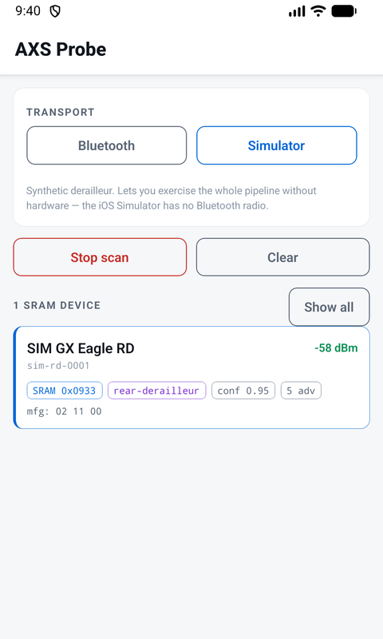
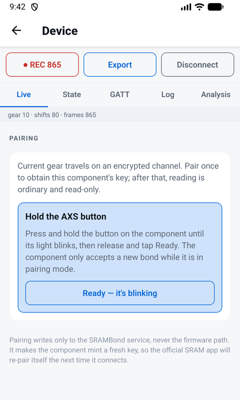
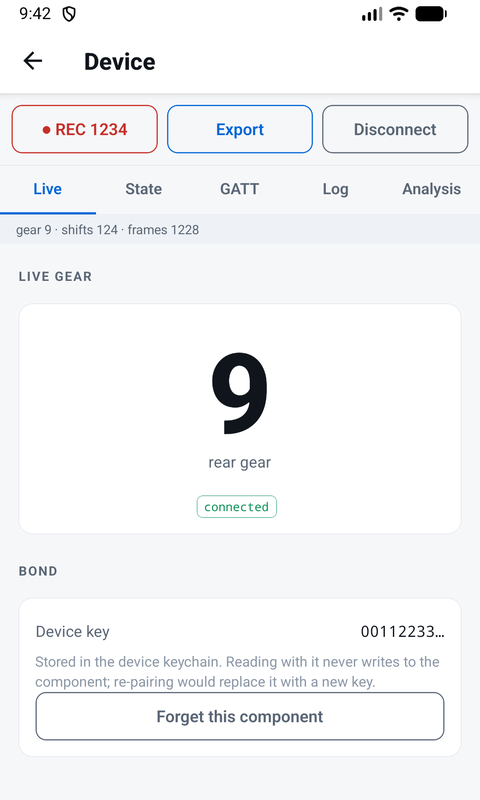
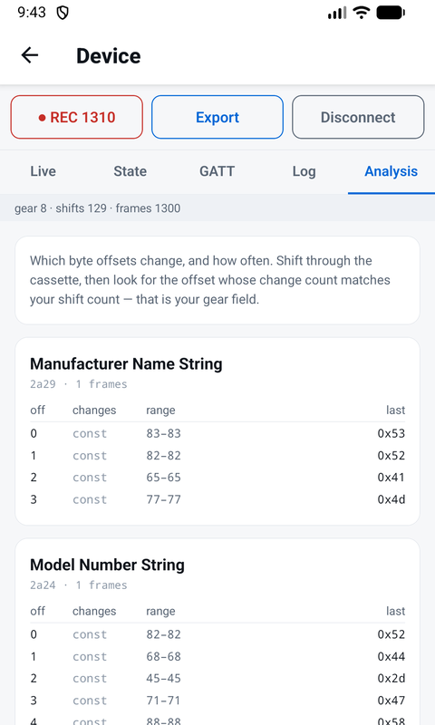

# sram-axs

[](https://github.com/GaborWnuk/sram-axs/actions/workflows/ci.yml)
[](https://codecov.io/gh/GaborWnuk/sram-axs)
[](https://www.npmjs.com/package/@gaborwnuk/axs-core)
[](LICENSE)

Read live state — including **current gear** — from SRAM AXS components over
Bluetooth Low Energy. A dependency-free TypeScript library, a CLI, and a demo app.

**Built for the AXS platform, not one product.** SRAM AXS shares one BLE stack,
one pairing handshake and one message format across the range — derailleurs,
drop-bar shifters and AXS Controllers, Reverb AXS seatposts, Flight Attendant
suspension, TyreWiz sensors, Quarq power meters and Eagle Powertrain. This
library is written against the platform, so it identifies, pairs with and decodes
any of them; what differs per component is only *which* messages it serves.

Verified today on a **GX Eagle Transmission `RD-GX-E-B1`** and an **AXS
Controller** — the only AXS hardware the author owns. Other components are
expected to work and will be confirmed as they become available; unverified model
identifiers are flagged as such in the library rather than asserted.

```
packages/axs-core/   @gaborwnuk/axs-core — BLE reconnaissance, SRAMBond pairing, decoding
apps/cli/            axs — scan, pair, read gear from a laptop
apps/demo/           Expo app: scan, GATT explorer, raw logger, ride dashboard
```

## The demo app

<p align="center">
  
  
  
  
</p>

<p align="center">
  <em>Scan · pair · live gear · byte-volatility analysis. Captured from the built-in
  simulator, so every value shown is synthetic — the same screens run against real
  hardware.</em>
</p>

Published to npm as [`@gaborwnuk/axs-core`](https://www.npmjs.com/package/@gaborwnuk/axs-core).

## Start here

Read [`PROTOCOL.md`](PROTOCOL.md) — the complete protocol description, with flow
diagrams, a full GATT map, the pairing handshake byte by byte, and worked
examples. Short version:

An AXS derailleur carries **three radios**, per SRAM's own FCC filing
(`C9O-RDMB2`: *"Rear Derailleur with BLE, AIREA and ANT+ Radios"*):

| Radio | Role | This project |
|---|---|---|
| **AIREA** | shifter ⇄ derailleur shifting link | Not touched — proprietary, and not needed to read state |
| **ANT+** | one-way telemetry broadcast | Not pursued — phones no longer have the radio, and it carries far less than BLE |
| **BLE** | AXS app link — config, diagnostics, live state | **The only surface this project targets** |

Everything here is **BLE only**. The interesting state — gear, MicroAdjust,
diagnostics — lives there, and it is the one surface a phone can actually reach.

## Quick start

```bash
npm install
npm run check       # lint, typecheck, unit tests, build — no hardware needed
```

Then either point it at a real component (see [Usage](#usage)) or run the whole
pipeline against the built-in simulator, which needs no bike:

```bash
npm run axs -w @gaborwnuk/axs-cli -- simulate
```

## Usage

A real session, start to finish. This is verbatim from a `RD-GX-E-B1` on a bench,
with no phone involved.

### 1. Find the component

Wake it first — press the AXS button, or bounce the bike. AXS parts sleep hard,
and a silent scan almost always means asleep rather than broken.

```console
$ npm run axs -w @gaborwnuk/axs-cli -- scan --sram

Scanning for 15s…
 SRAM  SRAM 1234567890            -65dBm  a1b2c3d4e5f60718293a4b5c6d7e8f90
         mfg payload: 00 00 01 02 00 04 05 29 1e 03 80 37

9 devices, 1 SRAM.
```

The advertised name carries the serial, so `SRAM 1234567890` is the derailleur.
The long hex string is the platform's device id — that is what the other commands
take.

### 2. Pair once

Gear is encrypted, so the component has to hand over a key first. That happens
over the SRAMBond handshake, and it only works while the component is in pairing
mode — **hold its AXS button until the light blinks**. This is the one command
that writes to the device.

```console
$ npm run axs -w @gaborwnuk/axs-cli -- bond a1b2c3d4e5f60718293a4b5c6d7e8f90

Offline create-bond — writes to the SRAMBond service only, never the firmware path.

  ▶ Hold the derailleur's AXS button until the light blinks, then press Enter…
    · write init
    · write public key
    · read device public key
    · read transported key
    · write finalize
    · bonded

  Bonded. Device key: 0f1e2d3c4b5a69788796a5b4c3d2e1f0
  Reuse it read-only with:  gear a1b2c3d4e5f60718293a4b5c6d7e8f90 --key 0f1e2d3c…
```

(The key above is redacted — a real one is specific to your component.)

**Save that key.** It is all you need from then on, and reading with it never
writes to the component. In a script, use `--ready` instead of the prompt when the
component is already blinking.

Note that bonding makes the component mint a *fresh* key, so a previously saved
key stops working. That affects only the diagnostics link — never shifting — and
the official SRAM app re-bonds itself the next time it connects.

### 3. Read live gear

```console
$ npm run axs -w @gaborwnuk/axs-cli -- gear a1b2c3d4e5f60718293a4b5c6d7e8f90 \
    --key 0f1e2d3c4b5a69788796a5b4c3d2e1f0 --seconds 180

Reading gear for 180s — read-only, reconnecting automatically if the link drops.

  · connected
  gear 3 (fd 1, trim 12)
  3 → gear 4 (fd 1, trim 12)
  4 → gear 5 (fd 1, trim 12)
  5 → gear 6 (fd 1, trim 12)

575 frames decoded
```

That run decoded 575 frames over three minutes with no failures. If the link does
drop — the component sleeps, or you ride out of range — the reader reconnects on
its own with exponential backoff and carries on.

### Reading gear from your own code

`GearWatcher` is the piece you want: it owns the connection, the polling, the
decryption and the reconnects.

```ts
import { GearWatcher, type BleTransport } from "@gaborwnuk/axs-core";

// You supply the BLE stack; the library never imports one. See "Transports".
declare const transport: BleTransport;
declare const deviceId: string;
declare const deviceKey: Uint8Array; // 16 bytes, from `bond` or a previous session

const watcher = new GearWatcher(transport, deviceId, {
  deviceKey,
  pollIntervalMs: 250,       // ≈4 Hz, the cadence the official app uses
});

watcher.events.on("gear", ({ gear, previous }) => {
  console.log(`shifted ${previous ?? "?"} → ${gear}`);
});

watcher.events.on("status", ({ status, attempt }) => {
  // "connecting" | "connected" | "reconnecting" | "stopped"
  if (status === "reconnecting") console.log(`link dropped, retry #${attempt}`);
});

watcher.start();
// …later
await watcher.stop();
```

`watcher.currentGear` holds the latest value if you would rather poll than
subscribe. Use the `reading` event instead of `gear` if you want every frame
rather than only the changes, and `warning` for non-fatal trouble (a failed read,
a frame that would not decrypt).

The transport is yours to supply — the library never imports a BLE stack. Use
[`apps/cli/src/noble-transport.ts`](apps/cli/src/noble-transport.ts) on Node, or
[`apps/demo/src/ble/plx-transport.ts`](apps/demo/src/ble/plx-transport.ts) for
React Native.

### Pairing from your own code

```ts
import { createBond, type BleTransport } from "@gaborwnuk/axs-core";

declare const transport: BleTransport;
declare const deviceId: string;
declare function askTheRider(message: string): Promise<void>;
declare function saveKeyForDevice(id: string, key: Uint8Array): Promise<void>;

const peripheral = await transport.connect(deviceId);

const deviceKey = await createBond(peripheral, {
  // Must be a CSPRNG — the ephemeral private key has to be unguessable.
  // Node 19+ and browsers provide crypto.getRandomValues; Hermes does not, so
  // React Native needs a native source such as expo-crypto's getRandomBytes.
  randomBytes: (n) => crypto.getRandomValues(new Uint8Array(n)),
  waitForPairingMode: async () => {
    await askTheRider("Hold the AXS button until the light blinks");
  },
});
await peripheral.disconnect();

await saveKeyForDevice(deviceId, deviceKey);   // reuse it; do not re-bond
```

### Everything else on the component

Serial, model, firmware, battery, MicroAdjust and the cumulative shift counter
are all readable **without** a key:

```console
$ npm run axs -w @gaborwnuk/axs-cli -- probe a1b2c3d4e5f60718293a4b5c6d7e8f90

Model          RD-GX-E-B1
Serial         1234567890
Firmware       2.55.6      (build g313caa0ed6.dir)
Battery        93%
MicroAdjust    12 (range 1–23)
```

`probe` is strictly read-only and additionally prints the GATT tree and a
byte-volatility report, which is the tool for mapping characteristics that are
not decoded yet.

### Without hardware

The simulator speaks the real AXS shapes, encryption included, so the whole
pipeline — bond, decrypt, gear — runs with no bike:

```ts
import {
  FakeTransport,
  simulatedDerailleur,
  SIMULATOR_DEVICE_KEY,
  GearWatcher,
} from "@gaborwnuk/axs-core";

// No `declare` here: this snippet runs as-is, with no hardware.
const transport = new FakeTransport([simulatedDerailleur()]);
const watcher = new GearWatcher(transport, "sim-rd-0001", {
  deviceKey: SIMULATOR_DEVICE_KEY,
});

watcher.events.on("gear", ({ gear }) => console.log("gear", gear));
watcher.start();
```

## What works today

Verified against a real `RD-GX-E-B1` and cross-checked
against the SRAM AXS app. Running `npm run axs -w @gaborwnuk/axs-cli -- probe <id>` prints:

```
Model          RD-GX-E-B1
Serial         1234567890
Firmware       2.55.6      (build g313caa0ed6.dir)
Battery        93%
MicroAdjust    12 (range 1–23)
```

Every one of those matches the AXS app — and the build ID is something the app
does not show you.

**Confirmed:**

- **The AXS BLE protocol is protobuf.** That is the structural key; the library
  ships a schema-less protobuf reader that recovers field trees from raw bytes.
- Identification from the advertisement alone: company ID `0x0933`, plus the
  `SRAM <serial>` local-name pattern.
- Decoders for serial, model ID, firmware version + git build ID, MicroAdjust
  position, and battery. See [`PROTOCOL.md` §3](PROTOCOL.md).
- Full GATT enumeration separating standard SIG services from the 14
  vendor-defined ones.
- Raw frame capture, JSON export, offline replay, per-offset byte-volatility
  analysis.

Also decoded from live sweeps: a **cumulative shift counter** (verified twice —
exactly +22 across a 1→12→1 sweep) and a 16-bit uptime counter.

**Live gear — solved, over BLE, offline.**

Current gear is the `drivetrain_status.rd_position` protobuf field, carried
**encrypted on characteristic `d905000b`** (41-byte AES-EAX frames). Reading it
takes a per-device key, which a client obtains by performing SRAM's pairing
handshake itself:

- **SRAMBond create-bond** — a finite-field Diffie–Hellman (`g = 5`,
  `p = 2¹²⁸ − 713`) over `d905ee52`; the component then hands back a freshly-minted
  live-state key, encrypted under the DH shared secret. **Fully offline** —
  verified with the bike in airplane mode and all local key state wiped. The only
  gate is physical: the component must be in pairing mode (hold the AXS button),
  which is SRAM's anti-theft measure.
- Once you hold the key, a plain read of `d905000b` decrypts directly — no session
  needed.

Both the crypto and the handshake are implemented in `@gaborwnuk/axs-core` and verified
byte-for-byte against real captured bonds. From a laptop with no phone involved:

```
npm run axs -w @gaborwnuk/axs-cli -- bond <id>      # offline self-pair, print key, read gear
npm run axs -w @gaborwnuk/axs-cli -- gear <id> --key <hex>   # read-only gear with a known key
```

A live `bond` then tracked a full cassette sweep in real time (`1 2 … 12 … 1`),
decoding every frame. The full handshake, flow diagram, and security analysis are
in [`PROTOCOL.md`](PROTOCOL.md) §5–§9.

Note there is **no standard Device Information Service** on this hardware;
firmware and serial live in vendor characteristics.

## Security, and how this was researched

**No security vulnerability was found, and none is published here.** This is an
interoperability project: it reads telemetry from a device you own, using the
same interface and the same handshake the official app uses.

SRAM's design stands up well to scrutiny, and it is worth saying so plainly:

- **The safety-critical path is not on Bluetooth.** Shifting travels over the
  separate AIREA radio. Nothing on the BLE interface — not even a fully bonded
  session — can actuate the derailleur or shift someone's bike.
- **Pairing requires physical possession.** A new bond only completes while the
  component is in pairing mode, which you enter by physically holding the AXS
  button on the derailleur. You cannot pair with a bike you cannot touch. That is
  an effective anti-theft measure and it is why the handshake described here is
  not a remote attack surface.
- **Live state is properly protected.** The drivetrain channel uses authenticated
  encryption (AES-EAX) with a per-message nonce, keyed by a value the component
  generates itself and never transmits in the clear.
- **Firmware stays closed.** Firmware and signed configuration are gated by a
  cryptographic signature that this work neither has nor circumvents.
- **No secrets are disclosed.** Diffie–Hellman domain parameters are public by
  design; the per-device key is device-generated and delivered only over the
  physically-gated, encrypted bond. There is no embedded credential to leak.

**Method.** The protocol was reconstructed from **publicly available information**
— SRAM's own FCC filing, public support documentation, Bluetooth SIG assignments
— combined with **reverse engineering of a publicly distributed application and
observation of a device the author owns**, which is a well-established
interoperability practice. Every claim in [`PROTOCOL.md`](PROTOCOL.md) is backed
by captured data, and the test suite runs against those captures.

If SRAM would like anything here framed differently, the author welcomes that
conversation — see [`SECURITY.md`](SECURITY.md).

## Exploring the protocol

[Usage](#usage) covers reading gear. This is the other mode: mapping parts of the
component that are not decoded yet.

1. `probe <id>` enumerates the GATT tree and reads everything readable. It is
   strictly read-only — the probe never writes, because a Nordic buttonless DFU
   control point in the tree would reboot the component into its bootloader.
2. Shift through the cassette while polling, then read the byte-volatility
   report: the offset whose change count matches your shift count is the field
   you are hunting. Uniformly-random offsets are encrypted, not merely undecoded.
3. `--out capture.json` saves the raw frames; `analyze capture.json` replays them
   offline, so a decoder can be written and tested without the bike.

Emit a recognised key from a decoder's `fields` — `batteryPercent`,
`firmwareRevision`, `gearRear` — and `StateAggregator` and the dashboard pick it
up with no further wiring. Universal values land at the top level; anything
component-specific goes through a domain reducer into `state.domains`, so a
component that is not a drivetrain never carries a gear.

## Design decisions worth knowing

- **Reads and writes are separated.** The `probe` and `gear` paths never write —
  enforced and regression-tested. Pairing (`bond`) is the only writing path; it
  writes only to the SRAMBond service (`d905ee52`), never the Nordic
  buttonless-DFU control point, and requires the physical AXS-button pairing gate.
- **Capture first, decode later.** Frames are stored raw; decoding is a pure
  function applied afterwards, so a decoder written next week can be replayed
  against today's capture.
- **Confidence is tracked.** A speculative ANT-page reading (0.55) can never
  overwrite a confirmed GATT string (0.99), and the UI renders the two
  differently.
- **The core has no native dependencies.** Pure TypeScript, Hermes-safe, no Node
  built-ins — tested by bundling the app to Hermes bytecode in CI-equivalent
  form.

## Commands

| Command | Effect |
|---|---|
| `npm test` | Core unit tests — no hardware needed |
| `npm run lint` | ESLint + typescript-eslint across the monorepo |
| `npm run typecheck` | Typecheck all workspaces |
| `npm run build` | Build `@gaborwnuk/axs-core` (ESM + CJS + types) |
| `npm run check` | All of the above, in order |
| `npm run axs -w @gaborwnuk/axs-cli -- scan` | Find nearby AXS components |
| `npm run axs -w @gaborwnuk/axs-cli -- bond <id>` | Offline self-pair, then read live gear |
| `npm run axs -w @gaborwnuk/axs-cli -- gear <id> --key <hex>` | Read-only live gear with a known key |
| `npm run demo` | Start the Expo dev server |

## Licence

**[Mozilla Public License 2.0](LICENSE)** — Copyright (c) 2026 Gabor Wnuk.

Free to use in commercial and open-source products, including alongside
proprietary code. Two conditions: keep the attribution, and if you modify a file
covered by the licence, that file stays open source under the MPL and its source
must be available to whoever you give it to. Contributing changes back upstream is
the preferred way to satisfy that.

Not affiliated with, endorsed by, or connected to SRAM LLC. "SRAM", "AXS",
"Eagle", "Reverb", "TyreWiz", "Flight Attendant" and "Quarq" are trademarks of
SRAM LLC, used here only to describe interoperability. This tooling reads state
from, and pairs with, hardware you own; it does not modify firmware or bypass any
protection. See [`SECURITY.md`](SECURITY.md).
